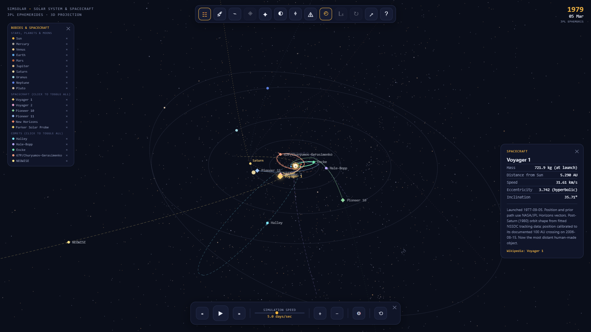
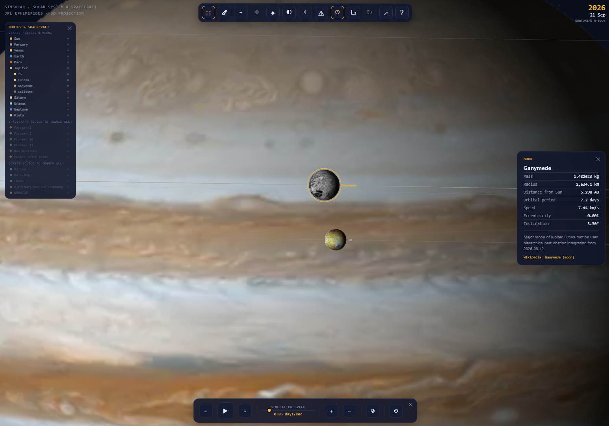
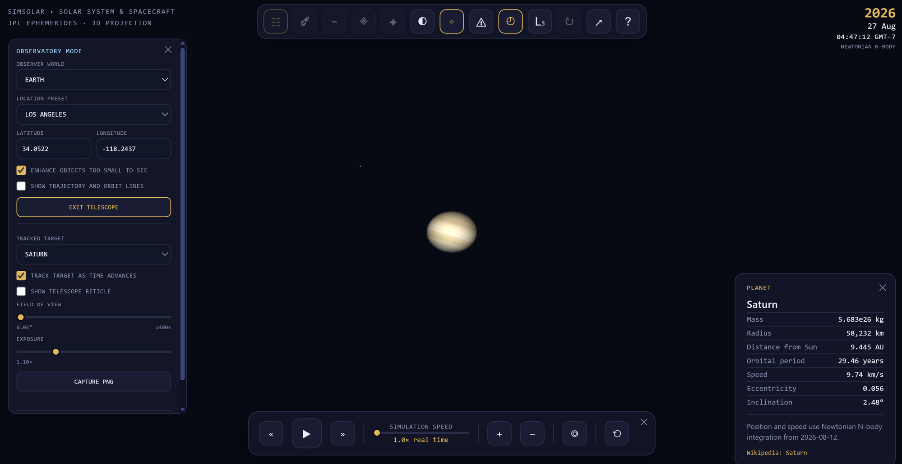
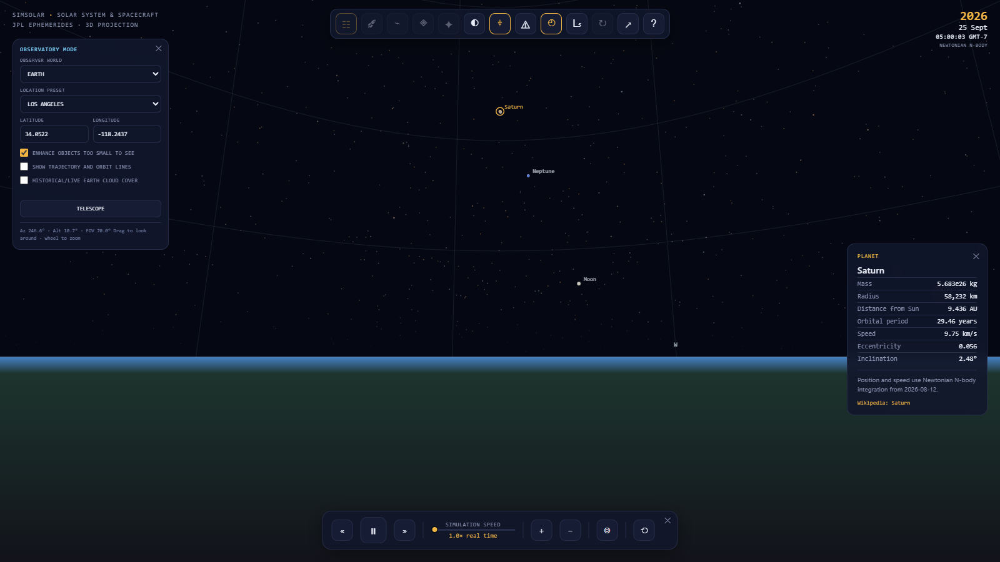
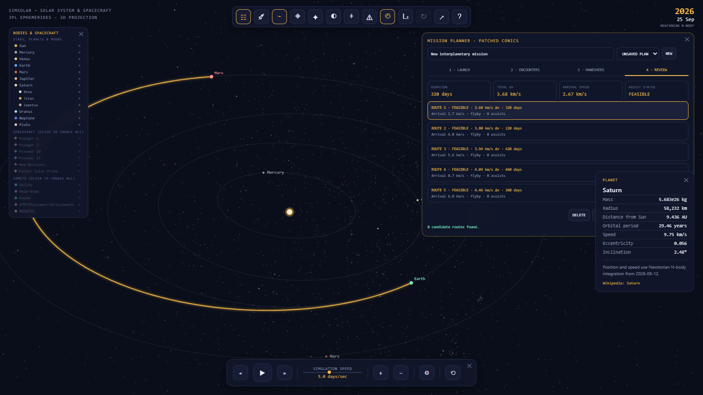
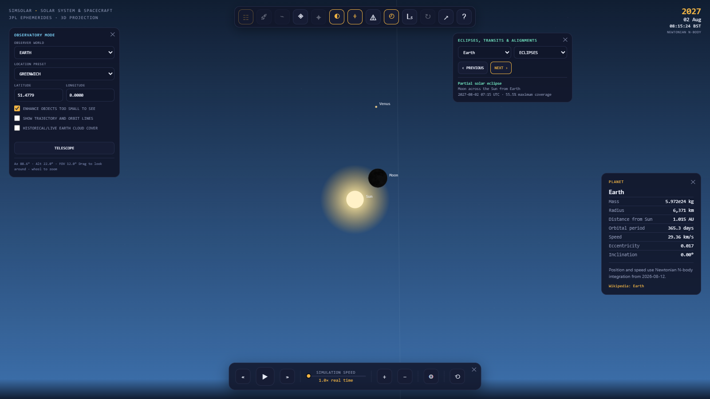
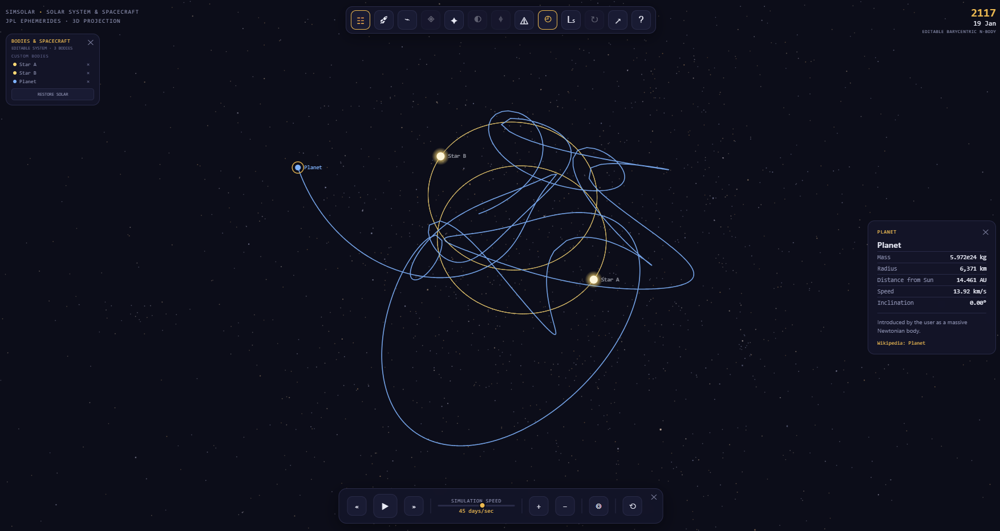

# SimSolar

<p align="center">
  <strong>An interactive solar-system, spacecraft, and gravity simulator that runs entirely in your browser.</strong>
</p>

<p align="center">
  <a href="https://miroslavplese.github.io/simsolar/"><strong>Launch SimSolar</strong></a>
  ·
  <a href="#explore-simsolar">Explore the highlights</a>
  ·
  <a href="#run-locally">Run locally</a>
</p>

<p align="center">
  <a href="https://miroslavplese.github.io/simsolar/">
    
  </a>
  <br>
  <em>Historic spacecraft missions and iconic comet paths in the standard Solar System view.</em>
</p>

SimSolar combines NASA/JPL ephemerides, interactive 3D projection, historical
mission paths, future Newtonian N-body integration, surface observation, and
mission planning in a dependency-free web app. Explore the real Solar System or
replace it with an editable system of stars, black holes, planets, and comets.

## Explore SimSolar

<table>
  <tr>
    <td width="50%" valign="top">
      
      <br>
      <strong>Planet and moon close-ups</strong><br>
      Zoom from the outer Solar System down to textured planets, rings, moving
      moon shadows, and 13 major moons with hierarchical dynamics.
    </td>
    <td width="50%" valign="top">
      
      <br>
      <strong>Tracked telescope mode</strong><br>
      Observe a target from a planetary surface with adjustable field of view,
      exposure, automatic tracking, an optional reticle, and clean PNG capture.
    </td>
  </tr>
  <tr>
    <td width="50%" valign="top">
      
      <br>
      <strong>Surface observation</strong><br>
      Stand on Earth, another solid world, a major moon, or a custom planet.
      Choose coordinates, identify planets in the night sky, accelerate time,
      and optionally reveal orbit and trajectory guides.
    </td>
    <td width="50%" valign="top">
      
      <br>
      <strong>Interplanetary mission planning</strong><br>
      Search launch and arrival windows, add gravity assists, compare ranked
      Lambert routes, inspect maneuvers, preview a flight, or enter the
      spacecraft cockpit.
    </td>
  </tr>
  <tr>
    <td width="50%" valign="top">
      
      <br>
      <strong>Eclipse, transit, and alignment search</strong><br>
      Find the next or previous event visible from a selected world, jump to
      its exact time, and inspect the geometry directly from the observer's
      surface.
    </td>
    <td width="50%" valign="top">
      
      <br>
      <strong>Editable N-body systems</strong><br>
      Replace the Solar System with stars, black holes, planets, and comets,
      then follow their barycentric trajectories, close encounters, and
      collisions.
    </td>
  </tr>
</table>

## Features

### Explore and observe

- Eight planets, Pluto and Charon, 13 major moons, six historic spacecraft, and
  five comets with NASA/JPL-derived positions and trajectories
- Lazy-loaded planetary textures with axial rotation, physical-scale close
  rendering, illumination, Earth clouds, moving moon shadows, depth-aware
  occultation, and shadowed planetary rings
- A camera-relative sphere of 8,870 Hipparcos stars with catalog positions,
  Johnson V magnitudes, B−V colors, and a cached offscreen backdrop
- Surface Observatory Mode for solid planets, moons, and custom planets with
  location presets, configurable coordinates, atmospheric daylight, horizon
  coordinates, true angular sizes, local civil time, and optional projected
  orbit and trajectory guides
- Optional live or historical Earth cloud cover using Open-Meteo forecasts and
  ECMWF ERA5 reanalysis
- Telescope mode with target tracking, a 0.05–10° field of view, fine aiming,
  exposure control, optional reticle, planetary rings, and PNG capture
- Eclipse, planetary transit, and one-degree planet-conjunction search with
  direct navigation to the event in Observatory Mode
- Selectable L1–L5 markers and co-rotating Sun-planet or planet-moon frames

### Missions and trajectories

- Mission timeline with launch and flyby jumps, UTC date navigation, automatic
  focus, object following, and physical information cards
- Patched-conic mission planner with Earth parking-orbit injection, ranked
  Lambert routes, optional finite-periapsis gravity assists, destination flyby
  or orbit insertion, maneuver details, animated previews, local saves, and
  shareable plans
- Spacecraft View for riding a planned mission with a velocity-aligned cockpit,
  free-look and field-of-view controls, live telemetry, progress milestones,
  selectable encounter bodies, time acceleration, and shareable cockpit state
- Clickable planet, spacecraft, and comet paths, with incrementally sampled
  future trails that remain responsive through close encounters

### Physics and experimentation

- Elliptical and hyperbolic Kepler solvers plus future-only barycentric
  Newtonian N-body gravity initialized from exact JPL state vectors
- Hierarchical major-moon integration with external tides, mutual moon
  perturbations, parent recoil, checkpoints, and custom-body gravity
- Interactive insertion of stars, black holes, planets, and comets with
  configurable properties and 0–180° orbital inclination
- Editable star systems with blank-system creation, direct camera navigation,
  per-body and cascading deletion, barycentric evolution, and Solar preset
  restoration
- Physical-scale custom-body rendering in both system and Observatory views,
  including custom planets as observer worlds
- Swept-contact detection, predicted-impact warnings, deterministic
  close-encounter substeps, and momentum-conserving custom-body merging

### Interaction and sharing

- Animated simulation clock with adjustable speed and direction, responsive
  orbit rotation, right-button or two-finger panning, pinch/wheel zoom, movable
  panels, and Inner/Outer/Deep view presets
- Versioned scenario links that restore time, playback, camera, visible layers,
  selection, follow target, Observatory/telescope state, planned missions, and
  compact custom systems
- First-run guided tutorial with persistent completion and an always-available
  restart button
- Selection cards with physical and orbital data plus Wikipedia links
- Rolling average and p95 frame-time profiler for every view preset
- Keyboard shortcuts for major tools: `V` Spacecraft View, `W` mission planner,
  `M` mission timeline, `L` bodies, `T` time/view controls, `E` event search,
  `O` Observatory Mode, `G` Lagrange points, `R` rotating frame, and `P`
  profiler

## Run locally

Open `solar-system.html` in a modern browser. No build, package installation, or
web server is required.

## Repository layout

| Path | Purpose |
| --- | --- |
| `solar-system.html` | Complete application: markup, styles, data, simulation, rendering, and input |
| `data/planet-ephemerides.js` | Generated NASA/JPL Horizons planet state vectors |
| `data/planet-cutoff-states.js` | Exact NASA/JPL Horizons future-integration seed vectors |
| `data/moon-cutoff-states.js` | Generated NASA/JPL Horizons major-moon cutoff vectors |
| `data/spacecraft-trajectories.js` | Generated NASA/JPL Horizons trajectory samples |
| `data/comet-ephemerides.js` | Generated NASA/JPL Horizons comet state vectors |
| `data/hipparcos-stars.js` | Generated naked-eye Hipparcos star catalog from CDS VizieR |
| `docs/DESIGN.md` | Architecture, data model, numerical assumptions, and design decisions |
| `docs/ROADMAP.md` | Progress tracker and prioritized improvement backlog |
| `src/trajectory-math.js` | Shared interpolation and two-body propagation module |
| `src/mission-timeline.js` | Shared mission navigation helpers |
| `src/mission-planner.js` | Lambert solver, patched-conic route scoring, window search, and plan persistence |
| `src/mission-planner-ui.js` | Mission-planner workflow, route comparison, maneuvers, saves, and previews |
| `src/spacecraft-view.js` | Planned-flight camera frame, projection, leg selection, and telemetry |
| `src/frame-profiler.js` | Rolling frame-time statistics for view presets |
| `src/view-transform.js` | Camera rotation and view-space transformation helpers |
| `src/star-field.js` | Deterministic celestial-sphere generation and camera projection |
| `src/observatory-mode.js` | Surface frames, horizontal coordinates, sky projection, and daylight calculations |
| `src/scenario-state.js` | Validated versioned encoding for shareable URL scenarios |
| `src/system-model.js` | Editable-system identity, deletion, lighting, catalog, and validation helpers |
| `src/guided-tutorial.js` | First-run persistence and responsive guided walkthrough UI |
| `src/panel-drag.js` | Pointer-driven movable panel behavior and viewport clamping |
| `src/body-rendering.js` | Marker-to-physical-radius close-view transitions |
| `src/body-textures.js` | Lazy WebGL sphere projection and texture loading |
| `src/body-placement.js` | Inclined custom-body velocity and orbital-plane calculations |
| `src/body-lighting.js` | Lambert sphere lighting and geometric shadow tests |
| `src/moon-system.js` | Major-moon metadata and visibility thresholds |
| `src/hierarchical-moon-simulation.js` | Perturbed parent-moon hierarchy integration |
| `src/ring-system.js` | Physical ring bands and 3D equatorial-plane geometry |
| `src/lagrange-system.js` | Restricted three-body L1-L5 calculations and frame alignment |
| `src/occultation-system.js` | Apparent-disk overlap geometry and event refinement |
| `src/nbody-simulation.js` | Barycentric Newtonian integration and checkpoint replay |
| `tests/trajectory-tests.js` | Dependency-free numerical regression suite |
| `tests/mission-planner-tests.js` | Lambert, flyby, route search, sampling, and persistence tests |
| `tests/mission-planner-ui-tests.js` | Planner date, duration, and default-plan tests |
| `tests/spacecraft-view-tests.js` | Cockpit camera, projection, leg, and telemetry tests |
| `tests/star-field-tests.js` | Star generation and camera-relative projection tests |
| `tests/observatory-mode-tests.js` | Surface-frame and horizontal sky-projection tests |
| `tests/scenario-state-tests.js` | Shareable scenario encoding, URL, and validation tests |
| `tests/system-model-tests.js` | Editable-system deletion, lighting, catalog, and validation tests |
| `tests/guided-tutorial-tests.js` | Tutorial completion cookie and fallback persistence tests |
| `tests/panel-drag-tests.js` | Movable-panel interaction and clamping tests |
| `tests/body-rendering-tests.js` | Physical radius scaling and transition tests |
| `tests/body-texture-tests.js` | Texture thresholds, rotation, and metadata tests |
| `tests/body-placement-tests.js` | Custom-body inclination and velocity-rotation tests |
| `tests/body-lighting-tests.js` | Illumination and planet-shadow geometry tests |
| `tests/moon-system-tests.js` | Moon orbit, visibility, and focus-zoom tests |
| `tests/hierarchical-moon-tests.js` | Moon conservation, perturbation, continuity, and stability tests |
| `tests/ring-system-tests.js` | Planetary ring dimensions and projection tests |
| `tests/lagrange-system-tests.js` | Collinear, triangular, and rotating-frame tests |
| `tests/occultation-system-tests.js` | Eclipse, transit, overlap, and event-search tests |
| `tests/nbody-tests.js` | Conservation, continuity, and deterministic replay tests |
| `tools/fetch-trajectories.py` | Reproducible Horizons data generator |
| `tools/fetch-stars.py` | Reproducible Hipparcos catalog generator |

## Current limitations

- Historical dates use ephemerides rather than recomputing past gravitational
  interactions.
- Historical spacecraft positions and flybys use bundled NASA/JPL Horizons
  vectors through the date recorded in the generated data file.
- Planet, Pluto, and Charon markers use matching NASA/JPL Horizons state vectors
  from 1970 through 2035 so they align with historical launches and flybys.
- Comet paths use Horizons state vectors from 1950 through 2080.
- Dates beyond the bundled spacecraft vectors are propagated from the final JPL
  position and velocity under solar gravity only until the common N-body
  cutover epoch.
- Future gravity is Newtonian. Custom-body contacts are detected using estimated
  physical radii; impacts with natural bodies are report-only and custom-body
  merges conserve mass and linear momentum. Custom massive bodies trigger
  deterministic close-encounter substeps during fast flybys. Relativistic
  effects, singularity regularization, fragmentation, maneuvers, and comet
  outgassing are not modeled.
- Historical major-moon positions are two-body continuations from authoritative
  cutoff vectors; historical planetary and mutual perturbations are not replayed.
- Future moon dynamics cover 13 major moons. Omitted satellites remain absorbed
  into each parent system's gravitational parameter.
- Eclipse, transit, and conjunction searches use the configured surface
  observer. Atmospheric refraction and formal contact times are not yet modeled.
- Planet and spacecraft data is embedded in the application.
- Star positions are Hipparcos ICRS catalog directions at epoch J1991.25;
  proper motion and long-term precession are not yet applied.
- Dynamic body positions and traveled trails are rendered every animation frame,
  except that off-screen heliocentric paths are suppressed in close moon views.
- Planned transfers use zero-revolution heliocentric patched conics. Major moons
  are treated as heliocentric encounter points rather than receiving a separate
  parent-system capture leg, and finite burns, low-thrust flight, launch-site
  geometry, navigation uncertainty, and multi-revolution Lambert solutions are
  not modeled.
- Custom-system links are limited to 4096 encoded characters. Large systems
  remain usable in the current browser session but must be simplified before
  they can be shared by URL.
- Custom planets use a generic airless, zero-tilt surface with a 24-hour
  rotation and generic coordinate presets.
- Optional Earth cloud cover uses hourly Open-Meteo forecasts or ECMWF ERA5
  historical reanalysis from 1940 onward and requires an internet connection.
- Illumination, comet tails, and occultation tools use the most massive active
  luminous body. Secondary stars contribute gravity and render as stars but do
  not yet add separate light sources.
- Custom-system patched-conic planning treats the active massive system as a
  central barycentric gravity source; strongly non-central binary-star routes
  require full N-body mission planning.
- Interaction and visual regression tests are not yet automated.
- The interface has limited keyboard and screen-reader support.

## Hybrid gravity model

Historical dates use bundled JPL ephemerides. At
`2026-08-12 00:00:00 UTC`, JPL-backed position and velocity vectors initialize
from exact cutoff samples rather than sparse-ephemeris interpolation. Planetary
systems are represented globally
by their system barycenters. A nested 0.05-day moon integrator combines exact
parent-moon Kepler drift with external tidal, mutual-moon, and parent-recoil
kicks. Spacecraft and comets remain massless test particles. Checkpoints provide
deterministic future navigation, and custom massive bodies perturb both global
and moon-system branches. Long jumps are prepared in bounded chunks so the
browser can repaint progress between them. Adaptive substeps resolve
Newtonian custom-body flybys, but relativistic compact-object encounters
remain deferred. The browser UI currently caps future navigation at 2100 to
bound integration time and checkpoint memory.

## Contributing

Before changing orbital calculations, document the source, epoch, units, and
expected accuracy in `docs/DESIGN.md`. Track planned and completed work in
`docs/ROADMAP.md`, keeping tasks small enough to validate independently.
When adding user-configurable state, decide whether it should survive in a
shared scenario link. If so, update scenario capture, validation, restoration,
version compatibility, and `tests/scenario-state-tests.js` together.
When adding a major user-facing feature or changing an existing workflow,
update the guided tutorial steps and instructions in the same change. The
tutorial must always describe the current interface and its primary features.

## Test

Run:

```text
npm test
```

The dependency-free Node test suite validates source-sample interpolation,
ephemeris endpoint continuity, long-range propagation, N-body conservation and
deterministic replay, hierarchical moon continuity and stability, launch
proximity, flyby alignment, and mission navigation helpers.

## Refresh trajectory data

Run:

```text
python tools/fetch-trajectories.py
```

The generator downloads heliocentric Ecliptic J2000 vectors from NASA/JPL
Horizons and rewrites both generated files under `data/`. Internet access is
required only when regenerating the data, not when running the application.
